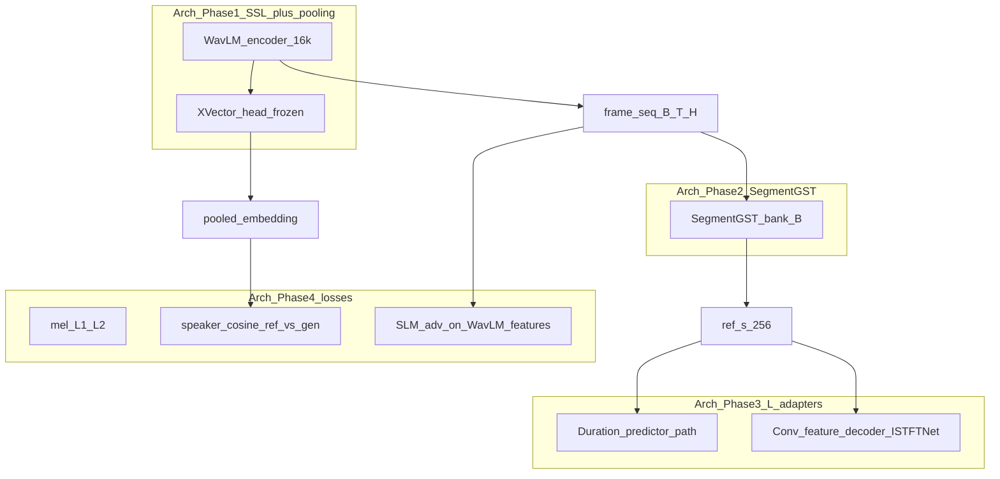

# Voice cloning with Kokoro — implementation plan (authoritative)

This document is the **single source of truth** for implementation. It aligns [architecture.md](/Users/huyhuynh/Voice-Clone-Kokoro-TTS/architecture.md) with these **locked design choices**:

| Architecture doc | Implementation |
|-------------------|----------------|
| WavLM-Base+ / Large, 16 kHz, frozen SSL | **[microsoft/wavlm-base-plus-sv](https://huggingface.co/microsoft/wavlm-base-plus-sv)** (`WavLMForXVector` + `Wav2Vec2FeatureExtractor`), **fully frozen** |
| ECAPA-TDNN + attentive pooling → \(z_{\text{speaker}}\) | **Pooled X-Vector embeddings** from the same checkpoint for **speaker consistency only** (native dim; L2-normalize for cosine). **No ECAPA**, **no SpeechBrain**, **no phase-0 training** |
| SegmentGST queries from “ECAPA before final pooling” | **WavLM encoder frame hidden states** (`last_hidden_state` or selected `hidden_states`), **before** the X-Vector head, with padding masks; optional **small trainable** 1D conv/downsample on frames if needed |
| Adversarial SLM | **Same frozen WavLM backbone**; **trainable** conv/MLP **discriminator on hidden features** (not on X-Vector embeddings) — feature-level StyleTTS2-style SLM |
| Trainable params | **SegmentGST**, **L-adapters**, **SLM discriminator**, optional **frame frontend**; **not** Kokoro, **not** WavLM-SV |
| Repo | **Vendored `speechbrain/` removed**; depend only on **`transformers`**, **`torch`**, **`torchaudio`**, **`kokoro`** (and dataset tooling you add) |

---

## Where code lives: repo copy vs conda (`custom-kokoro`)

**Two places in this repository:**

1. **`[repo]/kokoro/`** (existing copy) — **Kokoro source you edit** for adapter injection hooks ([kokoro/kokoro/modules.py](kokoro/kokoro/modules.py), [kokoro/kokoro/istftnet.py](kokoro/kokoro/istftnet.py), and only if needed [kokoro/kokoro/model.py](kokoro/kokoro/model.py)). This directory is the **authoritative working tree** for reading and changing Kokoro behavior; it is **not** a separate fork name unless you later publish one.

2. **`[repo]/voice_clone/`** (new) — **All voice-clone-specific code**: WavLM-SV wrapper, SegmentGST, adapters registry, losses, training loop, inference CLI. Nothing here replaces the `kokoro` package; it **imports** `kokoro` and loads weights/checkpoints as today.

**What actually runs in your conda env `custom-kokoro`:** `import kokoro` resolves to **whatever is installed in that environment** (typically `site-packages`), **not** automatically to `[repo]/kokoro/`. Editing files only under the repo **does not** change runtime until the environment sees that code.

**Recommended workflow (pick one and document it in README):**

- **Editable install (preferred):** from the repo, `pip install -e ./kokoro` (and later `pip install -e ./voice_clone` or root meta-package) **into `custom-kokoro`**. Then training and inference use the **same** edited sources under `[repo]/kokoro/` on every run.

- **PYTHONPATH:** prepend `[repo]/kokoro`’s parent so `kokoro` package resolves to the vendored copy; fragile if mixed with a conflicting site-packages install—usually uninstall non-editable `kokoro` first or use a dedicated env.

- **Non-editable reinstall:** after each Kokoro change, `pip install ./kokoro` again; works but is easy to drift from the repo.

**Summary:** Changes that touch Kokoro internals are made **in the copied `[repo]/kokoro/` directory**; **`voice_clone/` is new**. **`custom-kokoro` must be wired** (editable install or path) so Python loads **that** Kokoro, not an untouched PyPI-only tree.

---

## Mapping: architecture phases → code

---

## Kokoro integration (frozen)

**Source:** [kokoro/kokoro/model.py](kokoro/kokoro/model.py) — `forward_with_tokens(input_ids, ref_s, speed)`:

- `ref_s[:, :128]` → `decoder(...)` (ISTFT path / timbre).
- `ref_s[:, 128:]` → `ProsodyPredictor` style for duration, F0, N.

**GST output** must become **`ref_s ∈ R^{256}`** with the same split: `style_dec = [:128]`, `style_pred = [128:]`, `ref_s = cat(..., dim=-1)`.

**Freeze:** all `KModel` parameters `requires_grad_(False)`; training still **backprops through** the forward into `ref_s` and trainable modules.

**Injection sites** (architecture Phase 3, adapted to Kokoro’s **conv** blocks, not transformers):

1. **Duration predictor:** refactor [kokoro/kokoro/modules.py](kokoro/kokoro/modules.py) `DurationEncoder` (and optionally early `ProsodyPredictor` LSTM path) to apply **L-adapters** after chosen sub-blocks; equation:

   \(h' = h + W_{\text{up}}(\mathrm{ReLU}(W_{\text{down}}([h \parallel \tilde{z}_{\text{style}}])))\)

   with **`tilde{z}_{\text{style}}`** = GST output (256-D), same tensor everywhere adapters run.

2. **Feature decoder:** refactor [kokoro/kokoro/istftnet.py](kokoro/kokoro/istftnet.py) `Decoder.forward` — adapters after `encode` and after each `decode` `AdainResBlk1d`; optionally extend into `Generator` resblock groups if needed later.

**Default inference:** adapters absent or identity path so stock Kokoro behavior is unchanged.

**Caveat:** [Generator.forward](kokoro/kokoro/istftnet.py) uses `torch.no_grad()` on part of the harmonic branch; main conv path still receives gradients for waveform/mel losses.

---

## Conditioning forward (reference audio → `ref_s`)

1. Resample reference to **16 kHz**; run **feature extractor** + **WavLM backbone** with `output_hidden_states=True` as needed.
2. **SegmentGST** ([architecture.md](architecture.md) Phase 2): bank **`B ∈ R^{N×d}`** (configurable `N` e.g. 512–1024, `d` e.g. 256); **multi-head attention** — **queries** from **frame sequence** \(H\) (masked), **keys/values** from **`B`**; output **regularized** \(\tilde{z}_{\text{style}}\) then **linear → 256** and split for `ref_s`.
3. No separate “global \(z_{\text{speaker}}\)” required for Kokoro injection beyond this **`ref_s`**; the X-Vector embedding is **only** for the speaker **loss**, not for building `ref_s`.

---

## Losses ([architecture.md](architecture.md) Phase 4)

**Sampling:** same-speaker **reference** waveform + **target** text (+ target audio for supervision); G2P via **`KPipeline(lang_code=..., model=False)`** per sample.

1. **Reconstruction:** differentiable **mel** from **24 kHz** pred vs GT waveforms (`torchaudio`), FFT/hop/`n_mels` aligned with Kokoro **`config.json`** (`istftnet`, `n_mels`) loaded with `KModel`.

2. **Speaker consistency:** resample pred (and ref) to **16 kHz**; **`WavLMForXVector`** forward → **`outputs.embeddings`**, **L2-normalize** (per [HF model card](https://huggingface.co/microsoft/wavlm-base-plus-sv)):

   \(\mathcal{L}_{\text{speaker}} = 1 - \cos(\mathrm{Emb}(\text{ref}), \mathrm{Emb}(\text{gen}))\).

3. **SLM adversarial:** **frozen** WavLM **hidden states** (same checkpoint); **trainable D** (per-layer proj + temporal conv / multi-scale); **hinge or LS-GAN**; optimize **GST + adapters (+G)** vs **D** on alternating or 1:1 schedule. **D must not** use only the X-Vector embedding — **feature maps over time**.

**Loss weights:** config/YAML (`lambda_mel`, `lambda_spk`, `lambda_slm`).

---

## Multilingual G2P and data

- Each sample: **`lang_code`** (`a`, `b`, `z`, …), **text**, **ref audio**, **target audio** (and optional **speaker id** for logging).
- **Do not** mix incompatible **`KModel.repo_id`** / vocab in one training job without filtering (e.g. `hexgrad/Kokoro-82M` vs zh variant).

---

## Package layout (new)

Under repo root, e.g. **`voice_clone/`**:

| File | Role |
|------|------|
| `config.py` / `*.yaml` | HF id, GST `N`/`d`, adapter widths, loss lambdas, layer indices for SLM |
| `wavlm_sv.py` | Load frozen SV model; `pooled_embedding`, `frame_hidden_states` (+ masks) |
| `segment_gst.py` | SegmentGST → `ref_s` |
| `adapters.py` | `ResidualAdapter`; registry by site |
| `losses.py` | Mel, speaker cosine, SLM GAN |
| `train_adapters.py` | Loop, two optimizers (G vs D), AMP optional, checkpoints |
| `infer.py` | Ref wav + text + `lang_code` → phonemes → `ref_s` → `forward_with_tokens` |

**Dependencies:** root or `voice_clone` **`pyproject.toml`**: `torch`, `torchaudio`, `transformers`, local/path **`kokoro`**.

---

## Testing

- Tensor **shapes:** `ref_s` (256), GST, adapters vs `hidden_dim` / `style_dim` from Kokoro config.
- **Overfit** one batch: mel ↓, speaker cosine improves, SLM stable.
- **Inference:** load Kokoro + GST/adapter ckpt → non-silent finite waveform.

---

## Optional follow-ups (out of scope unless requested)

- Second WavLM instance strictly for SLM vs SV to avoid coupled gradients (usually unnecessary).
- Unfreeze harmonic branch in `Generator` for research.
- `architecture.md` text refresh to mention WavLM-SV instead of ECAPA (docs only).
